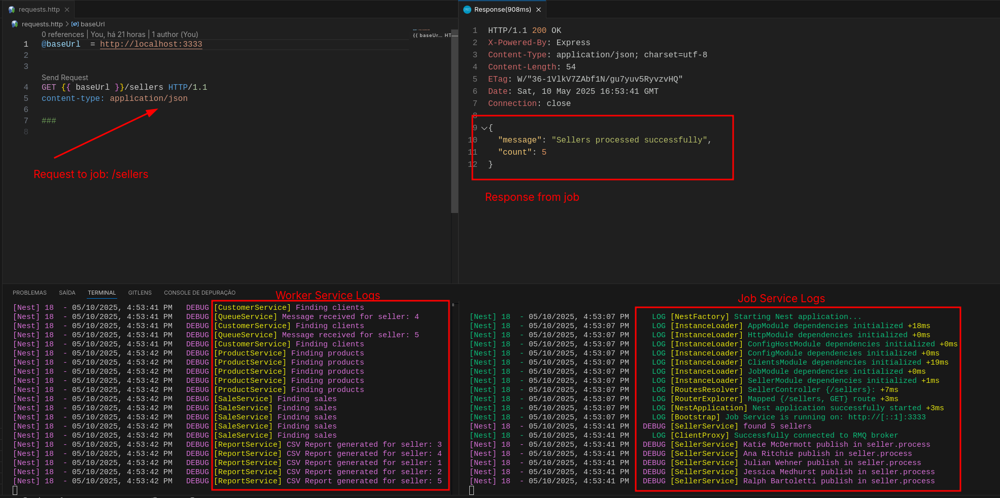

### Caso de Uso Mensageria: NestJS + RabbitMQ

Este é um projeto implementa dois microsserviços utilizando NestJS e RabbitMQ como orquestrador de filas:

**Serviço 1 (Job)**: Consome a API de Vendedores e publica mensagens no broker.
**Serviço 2 (Worker)**: Consome mensagens, busca dados adicionais e gera relatórios

### Componentes do Sistema:

**job-service**: Serviço responsavel por consultar a API de vendedores e publica mensagens no RabbitMQ
**worker-service**: Serviço que processa as mensagens e gera relatórios CSV para cada vendedor, consolidando dados de outras API.
**RabbitMQ**: Broker de mensagens para comunicação dos serviços

### Execução usando Docker Compose

Para executar todos os serviços de uma vez:

```bash
docker-compose up -d
```

Para verificar os logs:

```bash
# Todos os serviços
docker-compose logs -f

# Um serviço específico
docker-compose logs -f job-service
docker-compose logs -f worker-service
```

### Desenvolvimento Local

Para desenvolvimento local (sem Docker):

```bash
# Instalação/Execução dos serviços
cd job-service
npm install
npm run start:dev

cd worker-service
npm install
npm run start:dev
```

### Endpoints e Monitoramento

- **RabbitMQ Management**: [http://localhost:15672](http://localhost:15672)
  - Username: admin
  - Password: admin
- **Vendor Job**: [http://localhost:3333](http://localhost:3333)
  - `/sellers`: Realiza a busca dos vendedores e publica no worker
- **Reports Worker**:
  - `N/A`: Indisponível como REST, o servico esta trabalhando apenas worker de processamento dos dados. (ex: Gravar em um Bucket S3, R2, CloudStorage, etc..)

### Fluxo do Processo

1.  O serviço `job-service` executa um job que:
    - Consulta todos os vendedores da API
    - Publica uma mensagem para cada vendedor no RabbitMQ
2.  O serviço `worker-service`:
    - Consome mensagens da fila do RabbitMQ
    - Para cada mensagem, consulta os dados de vendas do vendedor
    - Para cada venda, busca dados do cliente e do produto
    - Consolida os dados em um relatório
    - Exporta um arquivo CSV na pasta `/reports`

### Relatórios Gerados

Os relatórios CSV serão salvos no diretório `reports/` com o formato:

```
vendedor-{id}.csv
```

### Como Testar

Certifique que todos os servicos estao up rodando utilizando Docker ou Local. Realize uma requisicao do tipo GET para o endpoint /sellers.

Obs: Caso esteja executando o projeto no VSCode utilize a extensao recomendada RestClient e execute o arquivo requests.http na raiz do projeto.

ou

```bash
curl http://localhost:3333/sellers
```

PS: Acomponhe os logs no terminal ou no container caso estiver utilizando o Docker.

Exemplo:


